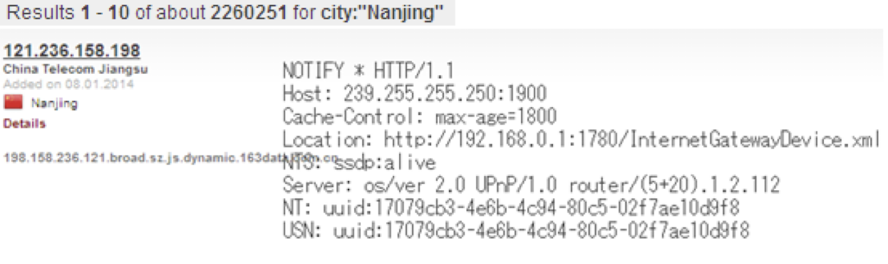

# 网络攻击原理与技术

第一章 绪论

### 1.1 网络空间安全概述

网络空间被称为与海陆空太空并列的第五空间。

#### 1.3.1 TCP/IP 协议安全性

ICMP: 为IP提供错误报告与诊断消息（辅助协议）

> “**不验证、无授权，ICMP 本想帮忙，结果常被拿去搞事。**”


```css
┌───────────────────────────┐
│       IP Header           │ ← IP 协议加的外层封装（含源IP、目的IP）
├───────────────────────────┤
│      UDP Header           │ ← UDP 加的头（含端口号等）
├───────────────────────────┤
│        Data               │ ← 应用层数据（如DNS查询内容）
└───────────────────────────┘
```

## 第三章&#x20;

&#x20;先通过Whois 数据库，获取目标站点的注册信息，然后利用这些信息进行后续攻击。

3.2.1 Baidu的重要检索命令

（1） site怎么使用

步骤：

1\. 打开百度：在浏览器中访问 [www.baidu.com](https://www.baidu.com)。

2\. 在搜索框中输入命令：你直接在搜索框中输入以下格式的命令：

• site:baidu.com 网络安全：会只在百度的官方网站上搜索有关“网络安全”的内容。

（2） link:\[Web页面]

1. 如果你想查找哪些网页链接到某个特定文章或页面，可以使用文章的URL：

（3）intitle:\[条件]

&#x20; (4) cache

cache: 命令是百度提供的一个高级搜索命令，它允许你查看百度缓存的网页内容。这个命令非常有用，特别是在以下情况下：

• 查找最近被移除或当前不可用的页面：如果某个网页由于删除、修改或服务器故障暂时无法访问，你仍然可以通过 cache: 命令查看该网页的快照版本。

• 查看页面历史版本：如果网页内容发生了变化，你可以通过缓存页面查看该页面的历史版本。

示例：

假设你想查看 CSDN 网站上的一个页面，但该页面已经被删除，或者当前无法访问。你可以使用 cache: 命令来查看百度缓存的该页面内容。

例如，使用以下命令：

```
cache:www.csdn.net
```

这个命令会显示 CSDN 网站的最近快照版本，即百度最近一次抓取 CSDN 网站的页面内容。如果该网站因为故障、删除或其他原因不可用，百度缓存仍然会显示该页面的内容。

操作步骤：

1\. 打开百度（[www.baidu.com](https://www.baidu.com)）。

2\. 在百度搜索框中输入以下命令：

```
cache:www.csdn.net

```

3\. 按下 回车，百度会返回 CSDN 网站的缓存页面内容。如果该页面已经被百度抓取，你将看到页面的快照。

使用场景：

• 网页故障排除：如果你发现某个页面无法访问，但该页面仍然对你有价值，使用 cache: 命令可以帮助你查看该页面的快照，获取内容。

• 网页删除后的访问：如果一个网站删除了某个页面，而你仍然希望查看该页面的内容，缓存版本可以作为一种替代访问方式。

通过使用 cache: 命令，你可以轻松地查看百度缓存的网页内容，特别是在网页暂时不可访问或已经被删除时。这对于网络安全分析、页面历史追溯等都非常有用。

&#x20;(5)例子

***

示例2：查找网站运行的用户活动脚本和程序

```
site:thefreakishlybigbank.com filetype:asp
site:thefreakishlybigbank.com filetype:cgi
site:thefreakishlybigbank.com filetype:jsp
```

目的：

• filetype:asp 查找目标网站上所有ASP（Active Server Pages）文件。

• filetype:cgi 查找所有 CGI（Common Gateway Interface）脚本。

• filetype:jsp 查找所有 JSP（JavaServer Pages）文件。


• 这些命令的目的是查找目标网站上运行的脚本和程序，这些脚本通常用于处理用户输入、表单提交等功能。通过获取这些文件，侦察人员可以评估潜在的安全漏洞。例如，ASP、CGI 和 JSP 文件可能包含不安全的编程实践，易受到 SQL 注入、跨站脚本（XSS）等攻击。

（6）Shodan

<figure><figcaption></figcaption></figure>

你上传的图片显示的是 Shodan 搜索引擎 返回的一条设备信息。以下是详细说明：

<br>

🔍 图片中的指令含义：

图片顶部的搜索命令为：

city:"Nanjing"

该指令用于在 Shodan 中搜索 位于南京的设备。

<br>

🌐 左侧信息（设备基本信息）：

* IP 地址：121.236.158.198
*
  * 这是设备暴露在互联网上的 IP 地址，表示该设备在公共互联网上可被访问。
* 运营商：China Telecom Jiangsu
*
  * 表明该 IP 地址属于江苏省的中国电信。
* 地理位置：🇨🇳 南京 (Nanjing)
*
  * 设备位于江苏南京市。
* Hostname 主机名信息：\
  198.158.236.121.broad.sz.js.dynamic.163data.com.cn
*
*
  * 该主机名表明是动态IP地址，通常由宽带网络分配，属于中国电信的163数据网络。

<br>

📄 右侧信息（Banner 详细信息）：

该设备的 Banner 内容：

NOTIFY \* HTTP/1.1

Host: 239.255.255.250:1900

Cache-Control: max-age=1800

Location: http://192.168.0.1:1780/InternetGatewayDevice.xml

NTS: ssdp:alive

Server: os/ver 2.0 UPnP/1.0 router/(5+20).1.2.112

NT: uuid:17079cb3-4e6b-4c94-80c5-02f7ae10d9f8

USN: uuid:17079cb3-4e6b-4c94-80c5-02f7ae10d9f8

以上 Banner 信息属于 UPnP（通用即插即用）设备发现协议（SSDP）：

* NOTIFY \* HTTP/1.1：\
  设备使用了 SSDP 协议进行广播，这个消息通常用于设备发现。
* Host: 239.255.255.250:1900\
  239.255.255.250 是标准的多播地址，1900端口是SSDP协议的默认端口。
* Location：\
  http://192.168.0.1:1780/InternetGatewayDevice.xml
* \
  提供了设备描述文件的本地地址，表明这是一个家庭或企业路由器或网关设备。
* Server：\
  os/ver 2.0 UPnP/1.0 router/(5+20).1.2.112
* \
  表明该设备为路由器，支持 UPnP 1.0 协议，且可能有特定的固件版本 (5+20).1.2.112。
* UUID：\
  uuid:17079cb3-4e6b-4c94-80c5-02f7ae10d9f8
* \
  这是设备唯一标识码，用于设备之间的识别和通信。

<br>

📌 这些信息的重要性：

通过以上信息，我们可以知道：

* 这是一个暴露在互联网上的 UPnP 路由器设备。
* 提供了内部访问地址（192.168.0.1），有时可能意味着设备配置存在安全风险（比如默认密码或安全配置不当）。
* 路由器支持 UPnP，这可能存在被攻击者利用进行端口映射等操作的风险。

<br>

🚨 安全风险与建议：

* UPnP：\
  UPnP 协议存在安全隐患。如果设备未妥善保护，可能会被恶意利用，建议关闭不必要的 UPnP 功能。
* 内网地址暴露：\
  设备暴露出内部网络地址（如 192.168.0.1），这可能帮助攻击者进一步识别网络架构。
* 对外暴露敏感端口：\
  直接在互联网暴露路由器服务容易受到攻击。应使用防火墙规则限制访问范围，避免直接公开服务。

<br>

⚠️ 法律与伦理提示：\
使用 Shodan 搜索时务必遵循相关法律法规与伦理标准，禁止未经授权的访问或攻击行为。


3.2.2 whois 查询

[https://reports.internic.net/cgi/whois?whois\_nic=csdn.net\&type=domain](https://reports.internic.net/cgi/whois?whois_nic=csdn.net\&type=domain)

这个是whois找csdn的信息，里面

```
   Registrar: Alibaba Cloud Computing (Beijing) Co., Ltd.
```

[https://whois.aliyun.com/](https://whois.aliyun.com/) 继续找csdn.net 信息

3.2.3. DNS

域名服务器可以查询到目标组织内部的服务器等信息

多个服务器一起为一个域服务。

每个子域为了对域名进行功能性管理

nslookup可以查区域传送。每个区域zone相当于一个部门。


## 第六章 特洛伊木马

<figure><figcaption></figcaption></figure>


第七章口令攻击技术

1. wireshark

[https://www.youtube.com/watch?v=qTaOZrDnMzQ](https://www.youtube.com/watch?v=qTaOZrDnMzQ)


